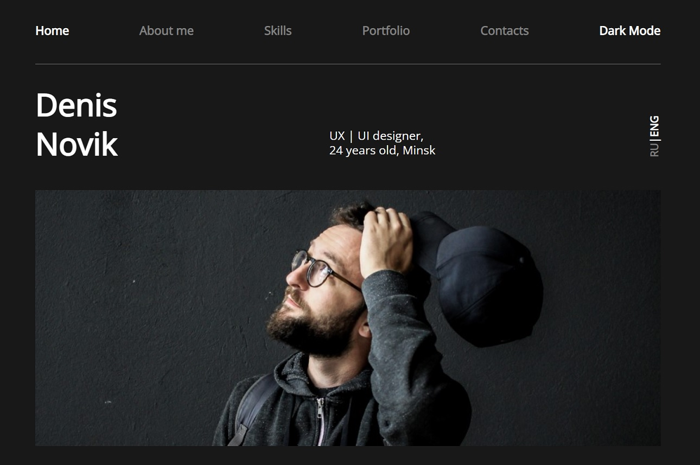

# UI/UX Designer Portfolio Page #
  

Business card site for UI/UX designers.

Technologies used by a website: HTML/CSS/JS.

[Github Pages](https://belskiy98.github.io/DNpage/)

Desktop version:

Mobile version:

Dark Mode:

Original layout by figma: 

